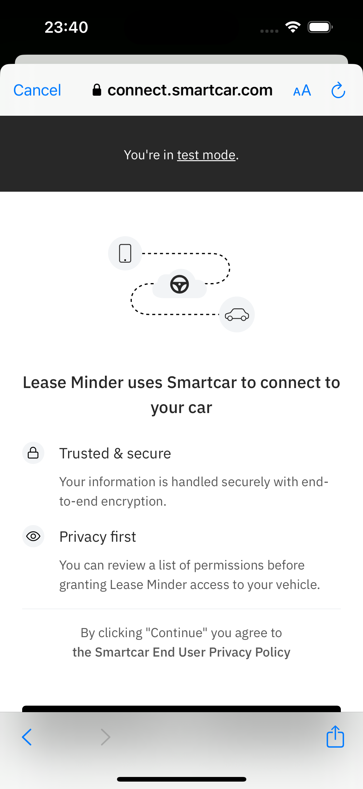
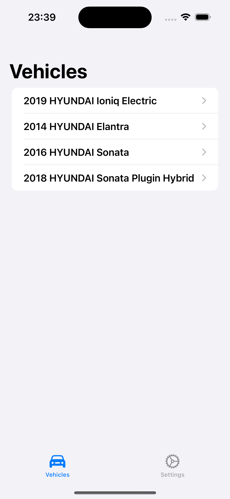
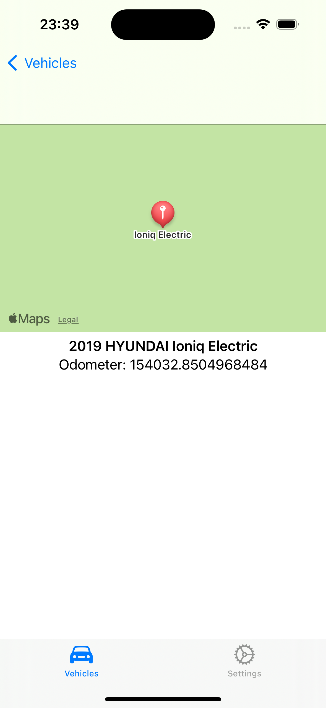

# Cars
This is just a really quick app I made to play with the Smartcar API and
SwiftUI for iOS 17. You log in, it displays a list of test cars, you pick one,
and it gives a map view and the odometer reading for it.

[Smartcar's API Documentation](https://smartcar.com/docs/getting-started/introduction)

## Cars SwiftUI App
As mentioned before, this is an iOS 17 app. I'm still learning Swift and
SwiftUI, so it may not be done in the best of ways, but it does run in the
simulator.

### Setting Up the App
Perform the following steps:

 1. Install [Cocoapods](https://cocoapods.org/)
 1. Change to the project directory and install the pods (`pod install`)
 1. Set your Smartcar Client ID in the `Config.swift` file.
 1. Make sure the backend is running (see below).
 1. Run the app using the play button on an iOS Simulator that supports iOS 17.

## Cars Backend
Super quick Python script to handle the server side aspects of the Cars iOS
app. Only handles exchanging an access code for an access token and a couple of
GET requests.

### Running the API
Perform the following steps:

 1. Set your environment variables:
    * `export SMARTCAR\_CLIENT\_ID=your-client-id`
    * `export SMARTCAR\_CLIENT\_SECRET=your-client-secret`
    * `export SMARTCAR\_REDIRECT\_URI=your-redirect-uri`
    * (Note: Your redirect URI should match your iOS redirect URI, which
      should be `sc{your-client-id}://exchange`)
 1. Create a virtual environment (`python3 -m venv env`)
 1. Source the virtual environment (`source env/bin/activate`)
 1. Install the requirements (`pip install -r requirements.txt`)
 1. Run the script (`uvicorn main:app --reload`)

The server should be running on `localhost:8000`.

## Screens

